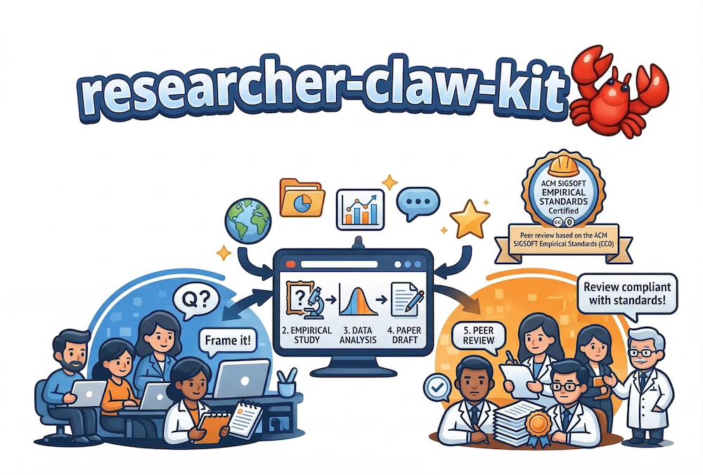

<div align="center">
  
  <h1>Researcher Kit</h1>
  <p><strong>Opinionated skills that cover the full arc of an empirical research paper: from problem framing to peer review.</strong></p>
  <p>
    Peer review based on the <a href="https://acmsigsoft.github.io/EmpiricalStandards/">ACM SIGSOFT Empirical Standards</a> (CC0).
  </p>
  <p>
    <a href="https://github.com/just-claw-it/researcher-claw-kit/actions/workflows/validate-kit-pr.yml?branch=main">
      
    </a>
    <a href="LICENSE">
      
    </a>
  </p>
</div>

---

## Run the web app locally

```bash
cd web
npm ci
npm run dev
```

Open [http://localhost:3000](http://localhost:3000). Bring your own API key in the UI, or set provider env vars in `web/.env.local` (for example `ANTHROPIC_API_KEY`) so the server can call models without a browser key.

---

## Run with Docker

Build and run the same UI anywhere you can run containers (your laptop, **Oracle Cloud**, AWS, on-prem, etc.):

```bash
docker build -t researcher-kit .
docker run --rm -p 3000:3000 researcher-kit
```

Or use Compose:

```bash
docker compose up --build
```

The image bundles the Next.js app plus the `.claude/skills` and `standards/` trees so the API can load prompts at runtime. Optional: pass through provider API keys as environment variables (see `docker-compose.yml`).

Details: [web/README.md](web/README.md).

---

## Install for Claude Code

```bash
git clone https://github.com/just-claw-it/researcher-claw-kit
cd researcher-claw-kit
./setup
```

Then add this to your `CLAUDE.md`:

```
## Researcher Kit
Available skills: /research-intake, /lit-review, /draft-review
Standards: ~/.claude/skills/researcher/standards/
Never fabricate citations. If a paper cannot be found via search, say so.
```

### Using with Cursor

Clone the repo into your project and point Cursor at the skill files.
The `AGENTS.md` file at the repo root works as a Cursor workspace rule
for skill routing. The skill prompts under `.claude/skills/researcher/`
can be referenced directly — no `./setup` install step is needed since
Cursor reads from the workspace tree.

---

## The three skills

### `/research-intake` — Frame the problem before you touch the data

**Use at:** the start of any project, before data collection.

You describe a research idea at any level of vagueness.
The skill reflects back what it heard, asks the three hardest questions
about your framing, proposes three alternative framings, and produces a
structured `PROBLEM.md` that feeds the downstream skills.

```
You:    I want to study how developers use LLMs for code review.
Skill:  [reflects back the idea]
        [asks: who changes behavior? what is already known? can your method answer this?]
        [proposes 3 framings with different research questions and implied methods]
You:    I'll go with Framing A.
Skill:  [writes PROBLEM.md]
```

Output: `PROBLEM.md` — research question, motivation, scope, contribution claim,
implied method, open risks.

---

### `/lit-review` — Map the literature and find your gap

**Use after:** `/research-intake` produces `PROBLEM.md`.

The skill builds a search strategy, searches arXiv and Semantic Scholar,
clusters results into direct competitors / methodological foundations / adjacent work,
identifies what the competitors did NOT show, and writes a positioning statement
that argues your contribution is non-redundant.

If your contribution already exists in the literature, the skill says so directly.
That is the most useful thing it can do.

```
You:    Run /lit-review [PROBLEM.md attached]
Skill:  [builds search strategy, asks for confirmation]
        [searches arXiv and Semantic Scholar]
        [clusters 8 papers into 3 categories]
        [writes positioning statement]
        [writes LIT_REVIEW.md]
```

Output: `LIT_REVIEW.md` — key papers, research gap, positioning statement,
missing literature warnings.

---

### `/draft-review` — Peer review against empirical standards

**Use after:** a draft exists — early drafts welcome.

The skill reads your draft, infers the research method from how you
collected and analyzed data (not from what you claim), presents its inference
for your confirmation, then applies the relevant ACM SIGSOFT Empirical Standard
plus the General Standard.

The review covers: essential attribute pass/fail, the weakest methodological
assumption, claim–evidence alignment for every major claim, a contribution
score (1–10), and a verdict with required changes in priority order.

```
You:    Run /draft-review [draft attached]
Skill:  "Based on your paper, I believe the primary research method is
         Experiment (with Human Participants), because you randomized
         participants across TDD and test-last conditions.
         Does this match your intent?"
You:    Yes.
Skill:  [loads experiment.md + general.md]
        [checks 17 essential attributes]
        [identifies weakest assumption]
        [checks claim-evidence alignment for 6 claims]
        [contribution score: 6/10]
        [verdict: Major revision — 3 required changes listed]
```

Verdict options: Accept | Minor revision | Major revision | Reject

---

## Supported research methods

18 methods with validated standards, all sourced from
[ACM SIGSOFT Empirical Standards](https://acmsigsoft.github.io/EmpiricalStandards/) (CC0):

| Method | Standard file |
|--------|--------------|
| Action Research | `standards/action-research.md` |
| Benchmarking | `standards/benchmarking.md` |
| Case Study / Ethnography | `standards/case-study.md` |
| Case Survey | `standards/case-survey.md` |
| Data Science | `standards/data-science.md` |
| Engineering Research | `standards/engineering-research.md` |
| Experiment (with Human Participants) | `standards/experiment.md` |
| Grounded Theory | `standards/grounded-theory.md` |
| Longitudinal Study | `standards/longitudinal.md` |
| Meta-Science / Methodological Guidelines | `standards/meta-science.md` |
| Mixed Methods | `standards/mixed-methods.md` |
| Optimization Study | `standards/optimization.md` |
| Qualitative Survey | `standards/qualitative-survey.md` |
| Quantitative Simulation | `standards/quantitative-simulation.md` |
| Questionnaire Survey | `standards/questionnaire-survey.md` |
| Repository Mining | `standards/repository-mining.md` |
| Replication | `standards/replication.md` |
| Systematic Review | `standards/systematic-review.md` |

All methods also apply `standards/general.md` automatically.

### For fields outside software engineering

No validated standard exists beyond `general.md`.
Reviews are marked **PROVISIONAL** until a domain expert co-signs
a field-specific standard. See [CONTRIBUTING.md](CONTRIBUTING.md).

---

## How the skills chain

```
/research-intake  →  PROBLEM.md
                         ↓
/lit-review       →  LIT_REVIEW.md
                         ↓
              [write draft]
                         ↓
/draft-review     →  structured peer review
                         ↓
              [revise] → /draft-review again
```

If `/draft-review` finds the contribution framing is fundamentally broken,
go back to `/research-intake`. The skills are designed to feed each other.

---

## CI

Every pull request runs:

1. **Kit checks** — required files, `kit.json`, `smoke.json`, and CI unit tests (`ci/`).
2. **Web app** — ESLint and production build (`web/`).
3. **Docker** — `docker build` from the root `Dockerfile` (same image as local/oracle deployments).

All jobs must pass before merge. Nightly CI re-runs kit validation, tests, and the web build; failures open an issue tagging the maintainer in `kit.json`.

---

## Repository structure

```
researcher-claw-kit/
├── README.md
├── CONTRIBUTING.md
├── LICENSE                          # MIT (code) + CC0 note (standards/)
├── SOUL.md                          # Kit personality and defaults
├── AGENTS.md                        # Skill routing guide
├── RESEARCHER_CLAUDE.md             # Claude Code integration guide
├── kit.json                         # Kit metadata
├── smoke.json                       # Behavioral smoke tests
├── setup                            # Install script
├── .claude/
│   └── skills/
│       └── researcher/
│           ├── research-intake/
│           │   └── research-intake.md
│           ├── lit-review/
│           │   └── lit-review.md
│           └── draft-review/
│               └── draft-review.md
├── standards/
│   ├── _index.md
│   ├── general.md
│   └── ... (18 method-specific standards)
├── Dockerfile                       # Production image for the web app
├── docker-compose.yml               # Optional local / server compose
├── web/                             # Next.js web app
│   └── ...
├── ci/                              # CI validator
│   ├── package.json
│   ├── tsconfig.json
│   └── src/
│       ├── validate-kit.ts          # Kit validation pipeline
│       ├── validate-smoke.ts        # Behavioral validation library
│       └── validate-smoke.test.ts   # Unit tests
└── .github/
    └── workflows/
        ├── validate-kit-pr.yml      # Blocks PR merge on validation failure
        └── nightly-check.yml        # Nightly validation check
```

---

## Contributing

See [CONTRIBUTING.md](CONTRIBUTING.md) for the full guide, including:
- How to write `smoke.json` for conversational skills
- How to add new behavior keys to the validator
- How to contribute standards for fields outside SE

---

## License

- **Code** (skills, web app, scripts): [MIT](LICENSE).
- **Empirical Standards text** in `standards/`: CC0 (see [LICENSE](LICENSE) and [ACM SIGSOFT Empirical Standards](https://github.com/acmsigsoft/EmpiricalStandards)).

---

## Acknowledgments

- [ACM SIGSOFT Empirical Standards](https://github.com/acmsigsoft/EmpiricalStandards) — the evaluation backbone (CC0)
